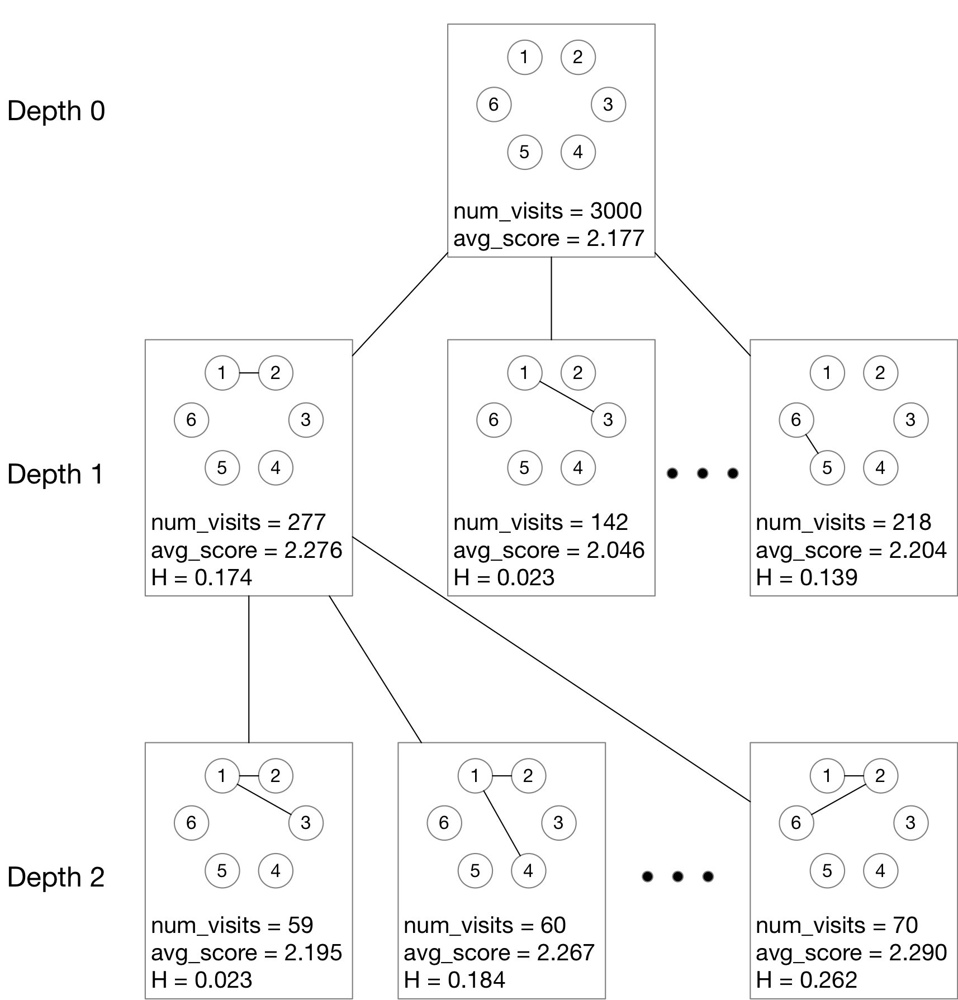
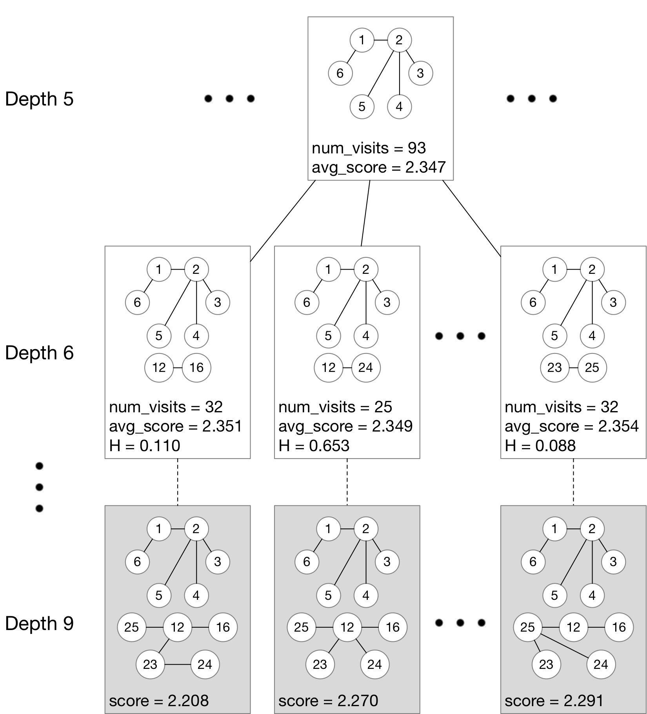

# Vine_MCTS

Code for the paper
> Chang, B., Pan, S. & Joe, H.. (2019). Vine copula structure learning via Monte Carlo tree search. International Conference on Artificial Intelligence and Statistics.

<p float="left">
  
  &nbsp;
   
</p>

## Install Python packages

Using [pip](https://pip.pypa.io/en/stable/installing/):
```
pip install -r requirements.txt
```

See [python-igraph website](https://igraph.org/python/) for detailed information on installing `python-igraph` package.

## Usage

### Generate correlation matrices

Use the following code to generate the correlation matrices, which are stored as `.csv` files in `data/corr` folder and used as input. For example, the following code will generate `data/corr/abalone.csv`.

```
cd data/raw_data/
python abalone.py
cd ../..
```

Customized input `csv` files can be created and saved in `data/corr` folder. The first line of the the `csv` files is the number of samples; the following lines are the correlation matrix. See `data/corr/abalone.csv` as an example.

### Run MCTS

```
python main.py -f abalone -ntrunc 4,5 -max_iter 5000
```

Other arguments:
```
usage: main.py [-h] [-f FILE_PREFIX] [-nw NUM_WORKER] [-fpu FPU] [-pb PB]
               [-log_freq LOG_FREQ] [-ntrunc NTRUNC] [-seed SEED]
               [-max_iter MAX_ITER]

optional arguments:
  -h, --help          show this help message and exit
  -f FILE_PREFIX      File prefix
  -nw NUM_WORKER      Number of workers to run in parallel (default: 1)
  -fpu FPU            First play urgency (default: 1.0)
  -pb PB              Progressive bias (default: 0.1)
  -log_freq LOG_FREQ  Log Frequency (default: 100)
  -ntrunc NTRUNC      A list of truncation level. For example, "2,3,4". By
                      default, levels from 1 to d-1.
  -seed SEED          Seed (default: 1)
  -max_iter MAX_ITER  Maximum number of iterations (default: 5000)
```

`FILE_PREFIX` is the filename of the input `csv` file. Results are saved in `output` folder.


## Interactive Jupyter Notebook example

Install [Jupyter Notebook](https://jupyter.org/install) and run the following:
```
jupyter notebook misc/visualization.ipynb
```

## BibTeX

```
@inproceedings{chang2019vine, 
  title={Vine copula structure learning via {M}onte {C}arlo tree search}, 
  author={Chang, Bo and Pan, Shenyi and Joe, Harry}, 
  booktitle={International Conference on Artificial Intelligence and Statistics}, 
  year={2019} 
}
```